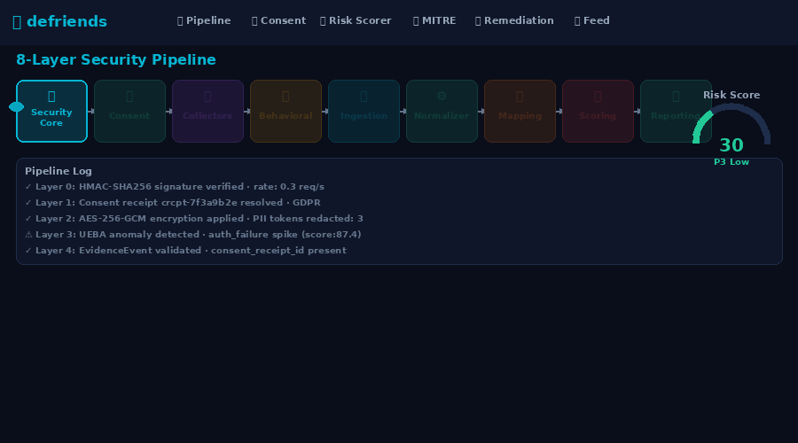
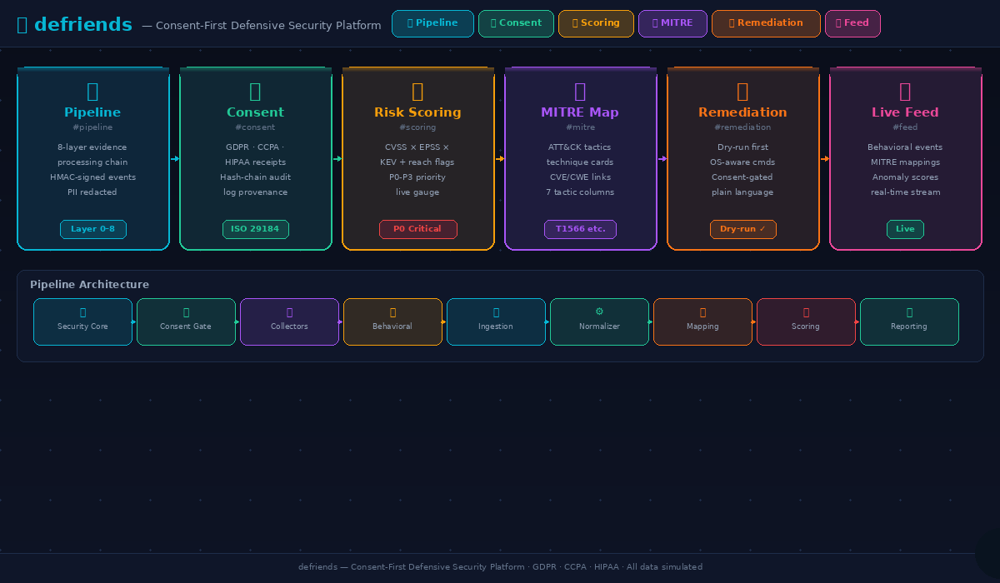

<div align="center">

# 🛡️ defriends

### Consent-First Defensive Security Platform

**Map real attack techniques. Score risk with precision. Fix it — with plain-language guidance, not jargon.**

[](#test-suite)
[](#privacy-consent--data-handling)
[](#retention)
[](#quickstart)
[](#interactive-demo)

</div>

---

## What is defriends?

defriends is a defensive security platform that runs on the machines you own, with your permission, and tells you — in plain language — what's wrong and exactly how to fix it.

### What it does (in one line)
**Consent-gated collection → normalize evidence → map to MITRE ATT&CK → score risk → generate reports + dry-run remediation.**

### Key principles

- **Consent before collection.** No log, scan, or behavior signal leaves the client until you have signed a consent receipt. Receipts are granular (per data category, per retention window).
- **Short retention by default.** Seven days by default. Extensions require fresh consent and are only allowed for serious findings.
- **Layman-friendly remediation.** Findings come with a plain-language explanation and dry-run-first commands you can copy/paste.

---

## Architecture at a glance

defriends processes security evidence through an 8-layer pipeline (plus a Security Core middleware layer):

| # | Layer | Responsibility |
|:--:|:----|:---|
| 0 | **Security Core** | `services/security_core/` — HMAC-signed events, rate limiting, CSP/HSTS, secret redaction, SSRF guards. Installed as middleware before every other route. |
| 1 | **Consent** | `services/consent/` — captures, stores, revokes, and audits every permission grant. GDPR, CCPA/CPRA, HIPAA, SOC 2, ISO 27001 aligned. |
| 2 | **Client Collectors** | `agents/collectors/log_collector.py` — cross-platform logs, AES-256-GCM at rest, PII redaction, 7-day auto-purge. |
| 3 | **Behavioral Analytics** | `services/behavioral/` — UEBA baselines, MAD-robust anomaly scores, emits EvidenceEvents into the core pipeline. |
| 4 | **Ingestion** | `services/ingestion/` — validates every `EvidenceEvent`, refuses anything without a valid `consent_receipt_id`. |
| 5 | **Normalizer** | `services/normalizer/` — deduplicates and standardizes CWE/CVE fields. |
| 6 | **Mapping** | `services/mapping/` — YAML rule engine maps CWEs to MITRE ATT&CK techniques. |
| 7 | **Scoring** | `services/scoring/` — `score = CVSS×55 + EPSS×25 + KEV×10 + Reachable×7 + Internet×3` → P0-P3. |
| 8 | **Reporting + Remediation + AI** | `services/reporting/` + `services/remediation/` + `services/ai_assistant/` — PDF/JSON reports, dry-run playbooks, plain-language walkthroughs. |

```
┌────────── Client machine (with your consent) ──────────┐
│  agent + log_collector.py (AES-GCM, 7-day purge)       │
│       │                                                │
│       │ (HMAC-signed EvidenceEvents, TLS 1.3)          │
└───────┼────────────────────────────────────────────────┘
        ▼
  [0] security middleware ──► [1] consent gate ──► [4] ingestion
                                                       │
             [3] behavioral ────────────────────────► [5] normalizer
                                                       │
                         [6] mapping (MITRE ATT&CK) ◄──┘
                                                       │
                                                       ▼
                                              [7] risk scoring
                                                       │
                                                       ▼
                          [8] report + remediation + AI assistant
                                                       │
                                                       ▼
                          PDF + JSON + dry-run fix scripts + chat
```

---

## Animated Demo

Click the preview below to open the live, interactive demo:

[](https://autobot786.github.io/defriends/demo.html)

---

## Interactive Demo

A **live, interactive demo** is included so users can understand basic usage without installing anything.

### Interactive workflow (colourful)

Click to explore the full interactive workflow:

[](https://autobot786.github.io/defriends/demo.html)

**Quick links — jump straight to a section:**

| Section | Link |
|:--------|:-----|
| 🔄 Pipeline | [demo.html#pipeline](https://autobot786.github.io/defriends/demo.html#pipeline) |
| 🔐 Consent Wizard | [demo.html#consent](https://autobot786.github.io/defriends/demo.html#consent) |
| 📊 Risk Scorer | [demo.html#scoring](https://autobot786.github.io/defriends/demo.html#scoring) |
| 🗺️ MITRE ATT&CK Map | [demo.html#mitre](https://autobot786.github.io/defriends/demo.html#mitre) |
| 🛠️ Remediation | [demo.html#remediation](https://autobot786.github.io/defriends/demo.html#remediation) |
| 📡 Live Feed | [demo.html#feed](https://autobot786.github.io/defriends/demo.html#feed) |

### Option A (recommended): Hosted demo (GitHub Pages)

Once enabled, you’ll have a public URL like:

- `https://autobot786.github.io/defriends/demo.html`

**Enable it**:
1. Go to **Settings → Pages**
2. **Source:** “Deploy from a branch”
3. Select **Branch:** `main` and **Folder:** `/ (root)`
4. Save

### Option B: Open locally (no server)

`demo.html` is a self-contained, zero-dependency browser demo. Open it with any modern browser — no build step.

```bash
# Clone the repo and open the demo directly
git clone https://github.com/autobot786/defriends.git
cd defriends

open demo.html          # macOS
xdg-open demo.html      # Linux
start demo.html         # Windows
```

| Section | What you can do |
|:--------|:----------------|
| 🔄 **Pipeline** | Click "Run Demo Pipeline" — watch a sample packet flow through all layers with a streaming log |
| 🔐 **Consent Wizard** | Walk through a consent flow and generate a `crcpt-*` receipt |
| 📊 **Risk Scorer** | Drag CVSS/EPSS sliders and toggle KEV/Reachable/Internet flags — the score gauge updates live |
| 🗺️ **MITRE ATT&CK Map** | Explore tactic columns populated from sample findings; click any card for CVE/CWE details |
| 🛠️ **Remediation** | Step through playbooks with an animated dry-run; "Apply" actions are consent-gated |
| 📡 **Live Feed** | Watch a simulated behavioral-event stream with MITRE mappings and anomaly scores |

---

## Quickstart

```bash
# 1. Clone and install
git clone https://github.com/autobot786/secmesh_scaffold.git
cd secmesh_scaffold/secmesh_scaffold
python -m venv .venv && source .venv/bin/activate
pip install -e packages/common && pip install -r requirements.txt

# 2. Run the unified server
python -m secmesh_scaffold
# → http://127.0.0.1:8080
#   /dashboard  /docs  /user  /login

# 3. On the machine you want to scan: grant consent, then scan
python agents/dirtybots_agent.py --server http://127.0.0.1:8080 \
      --org demo-org --asset my-laptop --env prod

# 4. Watch the pipeline
curl http://127.0.0.1:8080/health
```

First-time users get the onboarding wizard at `/v1/ai/app/onboarding/steps`; the assistant tailors a "what to do first" checklist based on role, jurisdiction, platform, and risk appetite.

---

## Privacy, consent & data handling

defriends is built around ISO/IEC 29184 consent-receipt semantics, mapped to each jurisdiction's legal framework.

| Framework | Rights honored | API |
|:---|:---|:---|
| **GDPR (EU)** | Access (Art. 15), rectify (16), erase (17), restrict (18), portability (20), object (21). Lawful basis is always recorded. | `POST /v1/consent/dsr` with `request_type=access|erase|...` |
| **CCPA / CPRA (CA)** | Right to know, delete, correct, opt-out of sale/share. Opt-out of sale is honored by default. | `POST /v1/consent/dsr` with `request_type=opt_out_sale|...` |
| **HIPAA (US healthcare)** | PHI-adjacent scope is off by default; requires separate authorization (45 CFR § 164.508). | `POST /v1/consent/...` |
| **SOC 2 / ISO 27001** | Every consent action is appended to a hash-chained audit log. | `GET /v1/consent/audit` |

### Retention

- **Default: 7 days** for every data scope.
- **Extended retention** only for serious findings *and* requires a new consent receipt (max 90 days).
- **Revocation** wipes the local cache and invalidates in-flight collection on next heartbeat.

### What is collected

Every scope is opt-in, set separately, and defaults to 7-day retention:

`system_logs` · `application_logs` · `auth_logs` · `network_metadata` · `process_metadata` · `installed_software` · `file_integrity_hashes` · `vulnerability_scans` · `behavioral_telemetry`

Raw logs never leave the client. Upstream receives only aggregated counters plus up to 25 PII-redacted snippets per batch.

---

## MITRE ATT&CK mapping

Every finding is resolved to a MITRE technique. The rule pack at `rules/mapping/mitre_cwe_context.v1.yaml` covers techniques across multiple tactics.

---

## Risk scoring

```
score = (cvss/10 × 55) + (epss × 25) + (kev × 10) + (reachable × 7) + (internet × 3)
```

| Priority | Score | Action |
|:---|:---:|:---|
| **P0 — Critical** | ≥ 85 | Fix today |
| **P1 — High** | ≥ 70 | Fix within 7 days |
| **P2 — Medium** | ≥ 50 | Fix this sprint |
| **P3 — Low** | < 50 | Track and monitor |

---

## Remediation with auto-fix (dry-run first)

Every finding maps to a `Playbook` with a plain-language explanation, OS-aware commands, a pre-flight check, a verify step, and a rollback. Every run defaults to **dry-run** — apply mode requires explicit consent + confirmation.

---

## AI application assistant

`/v1/ai/app/ask` is a deterministic, local, layman-friendly assistant. It explains anything in plain language and can generate an onboarding plan.

---

## Security posture

| Control | Where it lives | What it does |
|:---|:---|:---|
| HMAC-SHA256 event signing | `security_core/hmac_signer.py` | Ingestion rejects any event with bad signature or > 5-min timestamp skew |
| Token-bucket rate limiting | `security_core/rate_limit.py` | 120 req/min per IP or API key, returns 429 + Retry-After |
| Security response headers | `security_core/middleware.py` | HSTS, CSP, COOP, CORP, X-Content-Type-Options |
| Request body size cap | `security_core/middleware.py` | 5 MiB hard cap, 413 on exceed |
| Secret redaction | `security_core/sanitize.py` | Strips tokens/keys from outbound log/error |
| Prompt-injection filter | `security_core/sanitize.py` | Regex + HTML-strip defenses |
| SSRF guard | `security_core/sanitize.py` | Blocks private/link-local/metadata IPs on server-side fetch |
| At-rest encryption | `agents/collectors/log_collector.py` | AES-256-GCM on SQLite cache |
| Tamper-evident audit log | `services/consent/app/store.py` | Hash-chained audit log; audit endpoint validates chain |

---

## Test suite

```
236 tests passing — 100% success rate
```

---

## Project structure

```
secmesh_scaffold/
├── app_unified.py
├── services/
│   ├── security_core/
│   ├── consent/
│   ├── behavioral/
│   ├── remediation/
│   ├── ai_assistant/
│   ├── ingestion/
│   ├── normalizer/
│   ├── mapping/
│   ├── scoring/
│   ├── reporting/
│   └── gateway/
├── agents/
│   ├── collectors/
│   │   └── log_collector.py
│   ├── dirtybots_agent.py
│   ├── scripts/
│   └── examples/
├── packages/common/
├── rules/
├── schemas/
├── tests/
└── reports/pdf/
```

---

## Deployment modes

| Mode | Command | Best for |
|:---|:---|:---|
| **Unified** | `python -m secmesh_scaffold` | Dev, laptops, free-tier |
| **Microservices** | `docker compose up --build` | Production, horizontal scale |

---

## Defensive-only notice

defriends is a defensive security platform. It identifies, correlates, and reports on weaknesses — it does not contain exploit code, offensive payloads, or attack tools.

---

<div align="center">

**Built with care — because security shouldn't require a PhD.**

</div>
