# defriends

> **Authorized device security assessment — from raw evidence to plain-language PDF in minutes.**

---

## Live Demo

<!-- Place your animated screen recording at assets/demo.gif.
     Recommended tool: peek, LICEcap, or asciinema2gif.
     Resolution: 1280×720, 30 fps, 60–90 s capture of the full pipeline. -->


> **Don't have the GIF yet?**
> Record a screen capture of the full pipeline (login → ingest → score → report) and save it as `assets/demo.gif` in the repository root.

---

## Table of Contents

1. [About](#about)
2. [Automated Workflow](#automated-workflow)
3. [Project Structure](#project-structure)
4. [Installation](#installation)
   - [Prerequisites](#prerequisites)
   - [Clone & Setup](#clone--setup)
   - [Configuration](#configuration)
   - [Run Locally](#run-locally)
   - [Docker Deploy](#docker-deploy)
5. [API Reference](#api-reference)
6. [Testing](#testing)
7. [Troubleshooting](#troubleshooting)
8. [Privacy & Safety](#privacy--safety)

---

## About

**defriends** is a FastAPI-based security assessment workspace. It guides an authorized user from raw device or application evidence all the way to a signed-off, plain-language PDF report — with every intermediate step validated automatically.

Key capabilities:

| Capability | Description |
|---|---|
| 🔒 Auth-gated UI | Dashboard, docs, and API workspace require login |
| 📥 Ingestion | Accepts structured assessment records via REST |
| 🔄 Normalization | Prepares records for consistent downstream analysis |
| 🗺️ MITRE/CWE Mapping | Links findings to attack patterns from a YAML rule pack |
| 📊 Risk Scoring | Returns a priority and numeric risk score |
| 🛡️ Control Domains | Maps results to NIST SP 800-53 & ISO/IEC 27001:2022 |
| ✅ Legitimacy Check | Cross-validates totals, evidence, controls & recommendations |
| 📄 PDF Report | Produces a plain-language report for non-technical readers |
| 🤖 AI Assistant | Explains the next step and offers safe action buttons |

---

## Automated Workflow

```mermaid
flowchart LR
    A([🌐 Browser\nhttp://localhost:8080/login]) --> B[Login]
    B --> C[Dashboard /ui]
    C --> D[Ingest\nAssessment Record]
    D --> E[Normalize\nRecord]
    E --> F[Map Findings\nMITRE / CWE]
    F --> G[Score Risk\nPriority + Score]
    G --> H[Check Controls\nNIST / ISO]
    H --> I[Verify Legitimacy\nConfidence Score]
    I --> J[Generate PDF\nReport]
    J --> K([📥 Download\nReport])

    style A fill:#4a90d9,color:#fff
    style K fill:#27ae60,color:#fff
```



<details>
<summary><strong>Step-by-step breakdown</strong></summary>

| # | Stage | Action | Outcome |
|---|---|---|---|
| 1 | **Login** | Navigate to `/login`, sign in | Redirected to `/ui` dashboard |
| 2 | **Ingest** | Submit assessment record from the Ingestion card | Record accepted and queued |
| 3 | **Normalize** | Send record through the Normalizer card | Consistent format for analysis |
| 4 | **Map** | Run mapped finding review | Findings linked to MITRE/CWE patterns |
| 5 | **Score** | Run risk scoring | Risk priority + numeric score returned |
| 6 | **Controls** | Review control domain status | Failed/partial NIST & ISO areas flagged with fixes |
| 7 | **Legitimacy** | Run legitimacy verification | Confidence score confirms result integrity |
| 8 | **Report** | Generate report | Plain-language PDF ready for download |
| 9 | **AI Assistant** | Ask "What should I do next?" | Next action explained with safe action buttons |

</details>

<details>
<summary><strong>Protected routes (public exposure check)</strong></summary>

| Route | Unauthenticated behavior |
|---|---|
| `/ui` | Redirects to `/login?next=/ui` |
| `/docs` | Redirects to `/login?next=/docs` |
| `/user` | Redirects to `/login?next=/user` |
| `/v1/masterpiece/manifest` | Returns `401` |
| `/api` | Returns minimal service + login links only |

`/health` is intentionally public for deployment health checks.

</details>

---

## Project Structure

```
defriends/
├── app_unified.py                        # FastAPI gateway, auth, protected pages
├── requirements.txt                      # Python dependencies
├── Dockerfile / docker-compose.yml       # Container build & orchestration
├── start.sh / start.bat / start.ps1      # One-command launchers
├── assets/
│   └── demo.gif                          # ← place animated demo here
├── services/
│   ├── ingestion/app/api.py
│   ├── normalizer/app/api.py
│   ├── mapping/app/api.py
│   ├── scoring/app/api.py
│   ├── reporting/app/
│   │   ├── control_domains.py            # NIST/ISO control catalog
│   │   ├── legitimacy.py                 # Confidence cross-validation
│   │   └── pdf_renderer.py              # Plain-language PDF generator
│   ├── consent/app/api.py
│   ├── behavioral/app/api.py
│   ├── remediation/app/api.py
│   └── ai_assistant/app/assistant.py    # Action suggestions
├── rules/mapping/mitre_cwe_context.v1.yaml
├── schemas/report.schema.json
├── packages/common/                      # Shared Pydantic models
└── static/
    ├── login.html
    └── dashboard.html
```

| Service | Route prefix | Entry point |
|---|---|---|
| Unified Gateway | `/` | `app_unified.py` |
| Ingestion | `/v1` | `services/ingestion/app/api.py` |
| Normalizer | `/v1` | `services/normalizer/app/api.py` |
| Mapping | `/v1` | `services/mapping/app/api.py` |
| Scoring | `/v1` | `services/scoring/app/api.py` |
| Reporting | `/v1` | `services/reporting/app/api.py` |
| Consent | `/v1/consent` | `services/consent/app/api.py` |
| Behavioral | `/v1/behavioral` | `services/behavioral/app/api.py` |
| Remediation | `/v1/remediation` | `services/remediation/app/api.py` |
| AI Assistant | `/v1/ai/app` | `services/ai_assistant/app/api.py` |

---

## Installation

### Prerequisites

| Requirement | Version |
|---|---|
| Python | 3.11+ |
| pip | latest |
| Docker *(optional)* | 20+ |

### Clone & Setup

```bash
git clone https://github.com/autobot786/defriends.git
cd defriends

# Install shared library
pip install -e packages/common

# Install all dependencies
pip install -r requirements.txt
```

### Configuration

Copy the example environment file and edit as needed:

```bash
cp .env.example .env
```

| Variable | Default | Purpose |
|---|---|---|
| `DIRTYBOT_MAPPING_PACK` | `rules/mapping/mitre_cwe_context.v1.yaml` | MITRE/CWE rule pack path |
| `DIRTYBOT_REPORT_SCHEMA` | `schemas/report.schema.json` | Report JSON Schema path |
| `DIRTYBOT_ORG_ID` | `demo-org` | Default organization identifier |
| `PORT` | `8080` | App listen port |

### Run Locally

**Linux / macOS**

```bash
bash start.sh
```

Or directly:

```bash
DIRTYBOT_MAPPING_PACK=rules/mapping/mitre_cwe_context.v1.yaml \
DIRTYBOT_REPORT_SCHEMA=schemas/report.schema.json \
python -m uvicorn app_unified:app --host 127.0.0.1 --port 8080 --reload
```

**Windows PowerShell**

```powershell
.\start.ps1
```

Or directly:

```powershell
$env:DIRTYBOT_MAPPING_PACK = "rules/mapping/mitre_cwe_context.v1.yaml"
$env:DIRTYBOT_REPORT_SCHEMA = "schemas/report.schema.json"
python -m uvicorn app_unified:app --host 127.0.0.1 --port 8080 --reload
```

Open the app: <http://127.0.0.1:8080/login>

**Create a local user (first run)**

```bash
curl -X POST http://127.0.0.1:8080/v1/auth/register \
  -H "Content-Type: application/json" \
  -d '{"email":"demo@example.com","password":"ChangeMe123!","name":"Demo User","role":"admin"}'
```

### Docker Deploy

```bash
# Build and start
docker compose up --build

# App available at http://localhost:8000
```

Or use the pre-built image:

```bash
docker build -t defriends .
docker run -p 8000:8000 \
  -e DIRTYBOT_MAPPING_PACK=/app/rules/mapping/mitre_cwe_context.v1.yaml \
  -e DIRTYBOT_REPORT_SCHEMA=/app/schemas/report.schema.json \
  defriends
```

---

## API Reference

**Health check**

```bash
curl http://127.0.0.1:8080/health
```

**Public API index** (unauthenticated)

```bash
curl http://127.0.0.1:8080/api
```

```json
{
  "service": "defriends API",
  "status": "login_required",
  "login": "/login",
  "docs": "/login?next=/docs",
  "health": "/health"
}
```

Full interactive docs are available at `/docs` after login.

---

## Testing

```bash
# Fast targeted suite
pytest tests/test_e2e.py -q

# Full suite with verbose output
pytest tests/ -v
```

Expected result: **79 passed**

---

## Troubleshooting

<details>
<summary><strong>App won't start — missing module</strong></summary>

```bash
pip install -e packages/common
pip install -r requirements.txt
```

</details>

<details>
<summary><strong>Port already in use</strong></summary>

Change the port and update `PORT` in `.env`:

```bash
python -m uvicorn app_unified:app --host 127.0.0.1 --port 9090 --reload
```

</details>

<details>
<summary><strong>Login redirects loop</strong></summary>

Clear browser cookies for `127.0.0.1` and try again. Ensure the app is running before navigating to `/login`.

</details>

<details>
<summary><strong>PDF report is empty or errors</strong></summary>

Verify `DIRTYBOT_REPORT_SCHEMA` points to `schemas/report.schema.json` and that `reportlab` is installed:

```bash
pip install "reportlab>=4.2.2"
```

</details>

<details>
<summary><strong>Shared model changes not picked up</strong></summary>

Reinstall the common package:

```bash
pip install -e packages/common
```

</details>

---

## Privacy & Safety

- Run assessments only on systems you own or are **authorized** to test.
- Never commit real vulnerability records, credentials, or customer data to version control.
- Keep the dashboard behind login in any shared or production deployment.
- Treat generated PDF reports as sensitive security documents.
